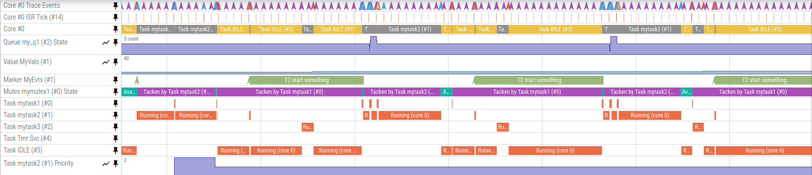

# Tonbandgerät

> **Tonbandgerät** /ˈtoːnbantɡərɛːt/ _n_.
>
> 1) German for _audio tape recorder_.
> 2) An electrical device for recording sound on magnetic tape for playback at a later time.

A small embedded systems tracer with support for bare-metal and FreeRTOS-based targets.

Philipp Schilk, 2024

---

## Overview

Tonbandgerät's [core](https://github.com/schilkp/Tonbandgeraet/tree/main/tband) is a small, portable, trace event generator
and handler written in C and designed for embedded systems. It requires minimal porting and configuration,
and features multiple backends for gathering and transmitting traces.

It can be used both with an RTOS, or in bare-metal environments to instrument user code and track hardware events by tracing interrupts.
Full tracing of FreeRTOS tasks and resources is also supported out-of-the-box.

Tonbandgerät is based on a simple custom binary trace format designed to be both compact and fairly fast to encode. Recorded
traces can be viewed in Google's in-browser perfetto after conversion with the provided CLI tool
or in-browser converter.

## Documentation
The documentation for Tonbandgerät can be found in the `docs/` folder and compiled for viewing with [mdbook](https://github.com/rust-lang/mdBook)
by running `mdbook build` in `docs/`. The latest version of the documentation can also be viewed online [here](https://schilk.co/Tonbandgeraet/docs/index.html).

## Trace Converter + Viewing
The trace converter, which is written in rust, can be found [here](https://github.com/schilkp/Tonbandgeraet/tree/main/tools). For convenience, there is
also a WASM version with web frontend, which runs in the browser and can be found [here](https://schilk.co/Tonbandgeraet/).

## Licensing
The [target tracer sources](https://github.com/schilkp/Tonbandgeraet/tree/main/tband) and [documentation](https://github.com/schilkp/Tonbandgeraet/tree/main/docs) are
released under the [MIT License](https://github.com/schilkp/Tonbandgeraet/blob/main/tband/LICENSE). All conversion and
analysis tools, such as the [decoder and converter](https://github.com/schilkp/Tonbandgeraet/tree/main/tools/tband-conv),
the [CLI](https://github.com/schilkp/Tonbandgeraet/tree/main/tools/tband-cli), and the
[web converter](https://github.com/schilkp/Tonbandgeraet/tree/main/web) are released under the [GNU GPL3 License](https://github.com/schilkp/Tonbandgeraet/blob/main/tools/tband-cli/LICENSE).

---
## Status

> [!NOTE]
> Tonbandgerät is in early development and by no means considered stable. Everything - including the
> binary trace format - is subject to change.
>
> Please report any issues [here](https://github.com/schilkp/Tonbandgeraet/issues).

### Completed:

#### Tonbandgerät:
- Trace encoder.
- Streaming backend.
- Snapshot backend.
- Metadata buffer.
- Initial FreeRTOS support.

#### Conversion tools:
- CLI converter.
- In-browser converter.

#### Other:
- STM32 + FreeRTOS example project.

### Work-In-Progress:

#### Tonbandgerät:

- Support for multicore tracing, including FreeRTOS SMP:
  Implemented and theoretically (almost?) done, but completely untested.

- Full FreeRTOS support, including some PRs: PRs are in a draft state/being
  reviewed. Certain FreeRTOS (rare) are not yet traced correctly due to insufficient
  tracing hooks. Tracing of streambuffers, direct-to-task notification, timers, and
  event groups are not yet Implemented.

#### Other:
- This documentation.

### Planned:

#### Tonbandgerät:
- Post-mortem backend.

#### Other:
- More examples, including a bare-metal project, RTT-backed project, and
  RP2040 SMP project.
- More example ports.

## Ideas:

#### Custom UI:
- Perfetto, while incredibly powerful and simple to target, is not a perfect match for Tonbandgerät.
  It cannot display arbitrary tracks, forcing them to be global or part of a process/thread hierarchy.
  This could be improved by generating synthetic linux ftrace events, but that is a can of worms I don't
  quite want to open. Furthermore, as it stands at the time of writing, a perfetto-based trace will never
  be able to display trace events in real time.

- A custom UI would enable real-time viewing an be the first step towards a more "integrated" desktop tool that
  could also handle trace recording (building on [probe.rs](https://probe.rs/) for RTT communication). A gui
  built on [tauri](https://tauri.app/) and/or [egui](https://github.com/emilk/egui) could continue to enable
  the current in-browser experience.

- If going the egui route, this could be a good basis: https://gitlab.com/surfer-project/surfer 

- GUI example/reference: https://github.com/wolfpld/tracy/blob/master/manual/tracy.tex
