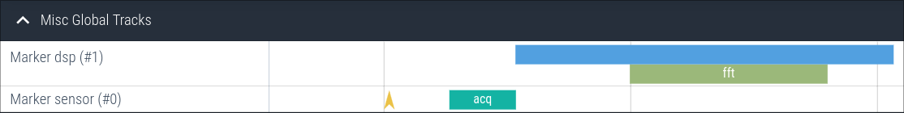

# Event Markers

Event markers are the most basic type of instrumentation. They allow you to quickly and easily
trace both instantaneous and span events. Each marker is uniquely identified by a 32-bit,
user-selectable ID. Note that markers are global, and can be started/stopped/triggered from any context.

A marker does not have to be initialized to be used, but can optionally be named. They support
(strictly) nested span events.

Any instant or (begin of a) span event can feature a string message. Note that long messages require
significant tracing resources and are best avoided if not strictly needed.

## Example

Consider the following (fictional) firmware. An external sensor triggers, once ready, an interrupt. Inside
the handler, a call to the `sensor_do_work()` function is scheduled, which in turn fetches the data from the sensor
and does some DSP processing involving an FFT.

To gain some insight into the timing and operation of this code, it is instrumented with Tonbandgerät event markers. First, during setup,
the event markers with IDs `0` and `1` are named. In the interrupt, an instant event is traced. In the callback, the
fetching of sensor data and DSP calculation are wrapped in span event markers.

```c
#include "tband.h"

#define MARKER_SENSOR  0
#define MARKER_DSP     1

// Setup:
void setup(void) {
    tband_evtmarker_name(MARKER_SENSOR, "sensor");
    tband_evtmarker_name(MARKER_DSP, "dsp");
}

// Sensor Ready ISR:
void isr(void) {
    tband_evtmarker(MARKER_SENSOR, "rdy");
    schedule_work(sensor_do_work);
}

// Sensor data readout/processing:
void sensor_do_work(void) {
    tband_evtmarker_begin(MARKER_SENSOR, "acq");
    collect_data_from_sensor();
    tband_evtmarker_end(MARKER_SENSOR);

    tband_evtmarker_begin(MARKER_DSP, "");
    dsp1();
    tband_evtmarker_begin(MARKER_DSP, "fft");
    fft();
    tband_evtmarker_end(MARKER_DSP);
    dsp2();
    tband_evtmarker_end(MARKER_DSP);
}

```

This code above would produce a trace similar to the following:



## Configuration

Markers are only traced if the [config option](./config.md) `tband_configMARKER_TRACE_ENABLE` is enabled.

## API

### `tband_evtmarker_name`:
```c
void tband_evtmarker_name(uint32_t id, const char *name);
```

Name the event marker with id `id`. This is a metadata event. If the [metadata buffer](./metadata_buf.md) is enabled,
it can be emitted at any time before or during the tracing session.


### `tband_evtmarker`:
```c
void tband_evtmarker(uint32_t id, const char *msg);
```

Trace an instant event.


### `tband_evtmarker_begin`:
```c
void tband_evtmarker_begin(uint32_t id, const char *msg);
```

Trace the beginning of a span event.

### `tband_evtmarker_end`:
```c
void tband_evtmarker_end(uint32_t id);
```

Trace the end of a span event.

