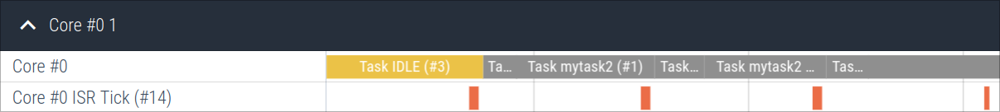

# Interrupts

Interrupts can be traced with an API that is rather similar to normal general
purpose [value markers](./valmarkers.md). They are also identified by a 32-bit
ID, and can optionally be named but don't otherwise require any kind of configuration.

Note that unlike event markers, they are local to one core. If two cores share an
interrupt, you will have to name it on both cores.

> [!TIP]
> Tracing of frequent interrupts may require significant resources.

## Example

In the example below, an interrupt routine is being traced:

```c
#include "tband.h"

#define TICK_ISR_ID

// Setup:
void setup(void) {
    tband_isr_name(TICK_ISR_ID, "tick");
}

void systick_isr(void) {
    tband_isr_enter(TICK_ISR_ID);
    // ...
    tband_isr_exit(TICK_ISR_ID);
}
```

ISRs are visualized next to the core they are associated with. The example
below shows a trace of the `SysTick` interrupt while FreeRTOS is running:



## Configuration

Interrupts are only traced if the [config option](./config.md) `tband_configISR_TRACE_ENABLE` is enabled.

## API

### `tband_isr_name`:
```c
void tband_isr_name(uint32_t id, const char *name);
```

Name the interrupt with id `id`. This is a metadata event. If the [metadata buffer](./metadata_buf.md) is enabled,
it can be emitted at any time before or during the tracing session.

### `tband_isr_enter`:
```c
void tband_isr_enter(uint32_t id);
```

Trace the beginning of an interrupt.

### `tband_isr_exit`:
```c
void tband_isr_exit(uint32_t id);
```

Trace the end of an interrupt.
