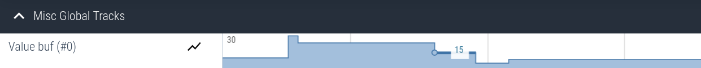

# Value Markers

Value markers allow you to track how a single numeric `int64_t` value changes over time. Each marker
is uniquely identified by a 32-bit, user-selectable ID. Note that markers are global and can be updated
from any context.

A marker does not have to be initialized to be used, but can optionally be named.

> [!TIP]
> Internally, Tonbandgerät uses a [varlen](../tech_details/varlen.md) encoding scheme for numeric values,
> so don't be appalled by the idea of using a 64-bit trace message to track your 8 bit value. Small values
> will only require a few bytes.

## Example

Consider the following firmware snippet that implements some for of buffer. The functions to
add and remove data from the buffer are instrumented with value markers to track how much data
the buffer contains at any given time.

```c
#include "tband.h"

#define MARKER_BUF  0

// Setup:
void setup(void) {
    tband_valmarker_name(MARKER_BUF, "buf");
}

// Add bytes to buffer:
void add_to_buf(struct buf *b, const uint8_t *data, size_t len) {
    tband_valmarker(MARKER_BUF, buf.len + len);
    // ...
}

// Read & remove bytes from buffer:
void remove_from_buf(struct buf *b, uint8_t *data, size_t len) {
    tband_valmarker(MARKER_BUF, buf.len - len);
    // ...
}

```

A trace of this imaginary fimware would like this:



## Configuration

Markers are only traced if the [config option](./config.md) `tband_configMARKER_TRACE_ENABLE` is enabled.

## API

### `tband_valmarker_name`:
```c
void tband_valmarker_name(uint32_t id, const char *name);
```
Name the value marker with id `id`. This is a metadata event. If the [metadata buffer](./metadata_buf.md) is enabled,
it can be emitted at any time before or during the tracing session.

### `tband_valmarker`:
```c
void tband_valmarker(uint32_t id, int64_t val);
```

Trace a new value.
