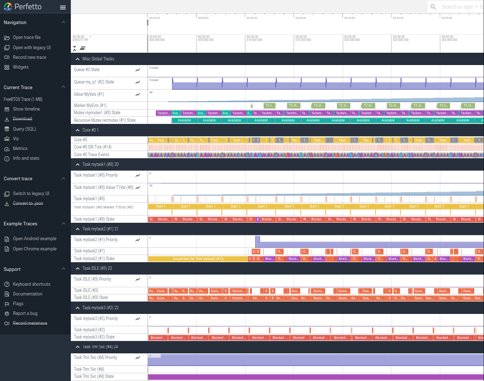

# Viewing Traces

The core trace decoder & interpreter is written in rust and can be found [here](https://github.com/schilkp/Tonbandgeraet/tree/main/conv/tband-conv).
It emits the [native protobuffer format](../tech_details/synthetto.md) of Google's [perfetto](https://perfetto.dev), an in-browser trace viewer 
made for traces much bigger and denser than what this tool will ever generate.

To use this converter, two UIs are provided:

- [tband-cli](./tband_cli.md) command-line tool, and
- the [web converter](./web.md), an in-browser converter which embeds the converter cross-compiled to WASM.

